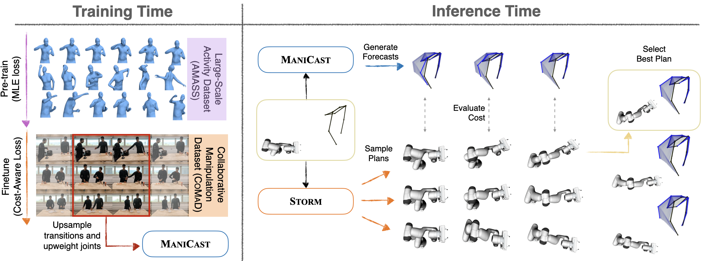
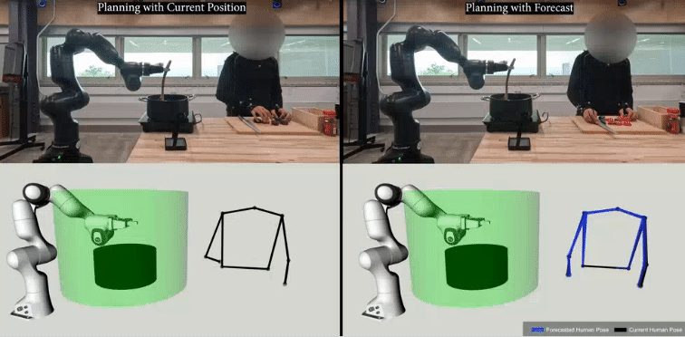
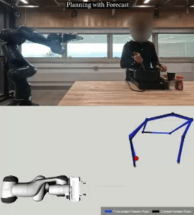

<!-- ## ManiCast: Collaborative Manipulation with Cost-Aware Human Forecasting

<a href="https://portal-cornell.github.io/manicast/">Website</a>

<a href="https://kushal2000.github.io/">Kushal Kedia</a>,
<a href="https://portfolio-pdan101.vercel.app/">Prithwish Dan</a>,
Atiksh Bhardwaj,
<a href="https://www.sanjibanchoudhury.com/">Sanjiban Choudhury</a> -->


## ManiCast: Collaborative Manipulation with Cost-Aware Human Forecasting

**[`Website`](https://portal-cornell.github.io/manicast) | [`Paper`](https://arxiv.org/abs/2310.13258)**

This is an official implementation for the CoRL 2023 paper:\
**ManiCast: Collaborative Manipulation with Cost-Aware Human Forecasting**
<br>
<a href="https://kushal2000.github.io/">Kushal Kedia</a>,
<a href="https://portfolio-pdan101.vercel.app/">Prithwish Dan</a>,
Atiksh Bhardwaj,
<a href="https://www.sanjibanchoudhury.com/">Sanjiban Choudhury</a>

<p align="center">
  
</p>

Our framework <b>ManiCast</b>
learns <b>cost-aware human motion forecasts</b> and <b>plans with such forecasts</b>
for <b>collaborative manipulation</b> tasks. At train time, we fine-tune pre-trained 
human motion forecasting models on task specific datasets by upsampling 
transition points and upweighting joint dimensions that dominate the cost 
of the robot's planned trajectory. At inference time, we feed these forecasts 
into a model predictive control (MPC) planner to compute robot plans that 
are <b>reactive</b> and keep a <b>safe distance</b> from the human.

### Setup

Setup environments following the [SETUP.md](docs/SETUP.md)

### Training

Pretrain model on large-scale data.
```
python src/pretrain.py --input_n 10 --weight 1
```

Finetune the above models using the ManiCast framework.
Add `--load_path default/<epoch num>` to load a model trained with `pretrain.py`.
```
python src/finetune.py --input_n 10 --weight 1
```

Finetune the above models with cost weighted regression.
```
python src/cost_aware_finetune.py --cost_weight .01
```


### Evaluation

Generate evaluation metrics on Object Handovers.
```
python eval/handover.py --ep_num 2
```

Generate evaluation metrics on Reactive Stirring.
```
python eval/reactive_stirring.py --ep_num 4
```

Generate evaluation metrics on CoMaD Dataset.
```
python eval/test_comad.py
```

### Results
<table border="0">
 <tr align="center">
    <td>
    <em>Reactive Stirring</em></td>
    <td>
    <em>Object Handover</em></td>
    <td>
    <em>Collaborative Table Setting</em></td>
 </tr>
</table>

<!-- ### Work in Progress -->

### Acknowledgement

This repository borrows code from [STS-GCN](https://github.com/FraLuca/STSGCN).

### Citation

```bibtex
@inproceedings{kedia2023manicast,
    title={ManiCast: Collaborative Manipulation with Cost-Aware Human Forecasting},
    author={Kushal Kedia and Prithwish Dan and Atiksh Bhardwaj and Sanjiban Choudhury},
    booktitle={7th Annual Conference on Robot Learning},
    year={2023},
    url={https://openreview.net/forum?id=rxlokRzNWRq}
}   
```